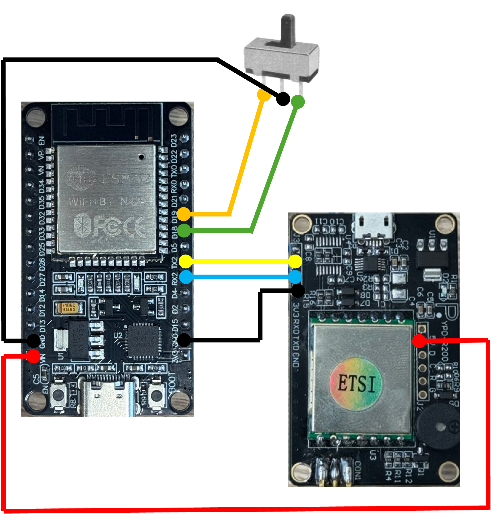

# RFID Transmitter Firmware

A firmware solution for RFID container tracking system that enables wireless transmission of RFID tag data.

## Overview

This firmware is designed to run on embedded devices to read RFID tags from containers and transmit the data wirelessly to a central system. It's part of the Connecta RFID container tracking solution.

## Features

- RFID tag reading using R200 module
- WiFi connectivity and HTTP API communication
- External configurable Location ID for different containers via tri state switch
- Time synchronization via NTP
- Continuous polling with automatic refresh
- Signal strength (RSSI) measurement

## Hardware Requirements

- ESP32 Microcontroller
- R200 RFID reader module
- Power supply (battery or external)

## Wiring

The R200 board need 5V power supply from the esp32 and is connected follows:

**R200 Connection Table:**
| ESP32 Pin   | R200 Pin   |
|-------------|------------|
| RX2         | TX         |
| TX2         | RX         |
| GND         | GND        |
| VIN         | 5V         |

**Tri-State Switch Connection Table:**
| ESP32 Pin   | Switch Pin          |
|-------------|---------------------|
| GPIO18      | Switch B            |
| GPIO19      | Switch A            |
| GND         | Switch GND (center) |


Connect each pin as shown below to ensure proper communication and power delivery between the ESP32 and R200 module.



## Configuration

1. Create your configuration file by copying the template:
```bash
cp default.config.h esp32/config.h
```

2. Edit `esp32/config.h` to match your setup:

```cpp
// WiFi Configuration
const char* WIFI_SSID = "your_network_name";
const char* WIFI_PASSWORD = "your_wifi_password";
const char* API_KEY = "your_api_key";
```

## Usage

1. Upload the firmware to your device
2. Set the switch to the desired container location (left, middle, right)
   - The switch will determine the `location_id` in the code
   - Values: **-1 (invalid), 1 (left container), 2 (middle container), 3 (right container)**
3. Power on the device
4. The device will automatically:
   - Connect to WiFi network
   - Initialize RFID reader
   - Start scanning for tags
   - Transmit data when tags are detected

## API Endpoints

The firmware communicates with the following endpoints:

- `GET /api/arsch/arsch` - Device health check
- `POST api/rfidreading/addreading` - Send RFID tag data

### Common Issues

1. **RFID not detected**: Check wiring connections
2. **WiFi connection failed**: Verify credentials in config.h
3. **Data transmission errors**: Check server endpoint availability